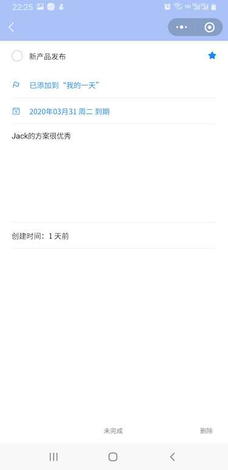

# 记我清单

## 简介
此项目基于小程序云开发，你不需要自己搭建服务器环境。产品原型参考自Microsoft To-Do（微软待办）

## 引导
- 你需要在project.config.json中的appid替换成你的appid便可用微信开发者工具预览
- 在云开发设置中创建环境并在appjs中设置你的环境id
- 你需要在云开发中的数据库中创建名为todos的集合
- 你需要在miniprogram文件夹下安装npm包,因为本项目使用了有赞的小程序组件 [vant-weapp](https://youzan.github.io/vant-weapp/#/intro)

## 功能介绍
### 我的一天
首页展示是我的一天的清单，你可以在我的一天中添加代办事项，也可以从重要清单和代办列表里选择清单添加到我的一天
{:width="200"}
### 重要
重要页面展示的是重要的代办清单包含着我的一天
:width="200"}
### 代办列表
代办列表是我的一天和重要清单的集合，你可以在该列表里查看所有类别的清单
:width="200"}
### 代办详情
详情也可以设置重要、完成、是否添加到我的一天、是否设置过期时间、添加备注、删除。
:width="200"}

## 参考文档

- [云开发文档](https://developers.weixin.qq.com/miniprogram/dev/wxcloud/basis/getting-started.html)

